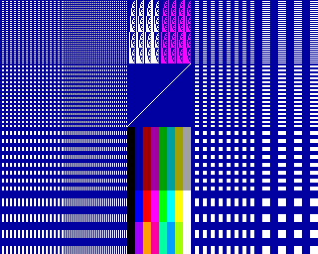
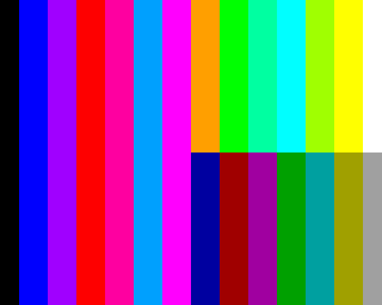
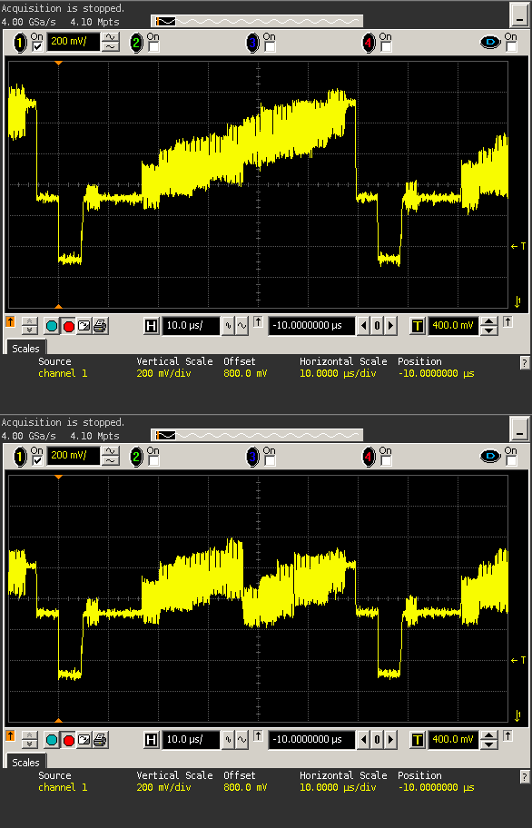

# Prüfprogramme

Die Prüfprogramme sind für die Inbetriebnahme des KC85/4 und zur Fehlersuche bei Hardwareproblemen entwickelt worden.
Manche Prüfprogramme (z.B. REGTEST) sind nur sinnvoll mit Messgeräten, wie z.B. einem Oszilloskop, zu gebrauchen.

Die hier abgelegten Prüfprogramme sind aus dem ROM P222.BIN herausgelöst und so angepasst, das direkt im KC lauffähig sind.

## BWS 55H

## Normaltestbild
Dieses Prüfprogramm ermöglicht eine allgemeine Beurteilung
der Farb- sowie Grafiktüchtigkeit des Gerätes.

## Pixeltestbild
Hier erfolgt eine Darstellung im hochauflösenden Pixelmode des
KC 85/4.

## Farbbalken
Dieses Prüfprogramm dient zum Feststellen von Fehlern auf der
Video-Leiterplatte.

Zum Vergleich das resultierende FBAS-Signal mit dem Oszilloskop aufgenommen:

