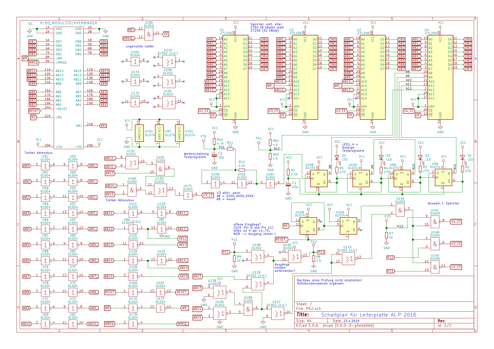
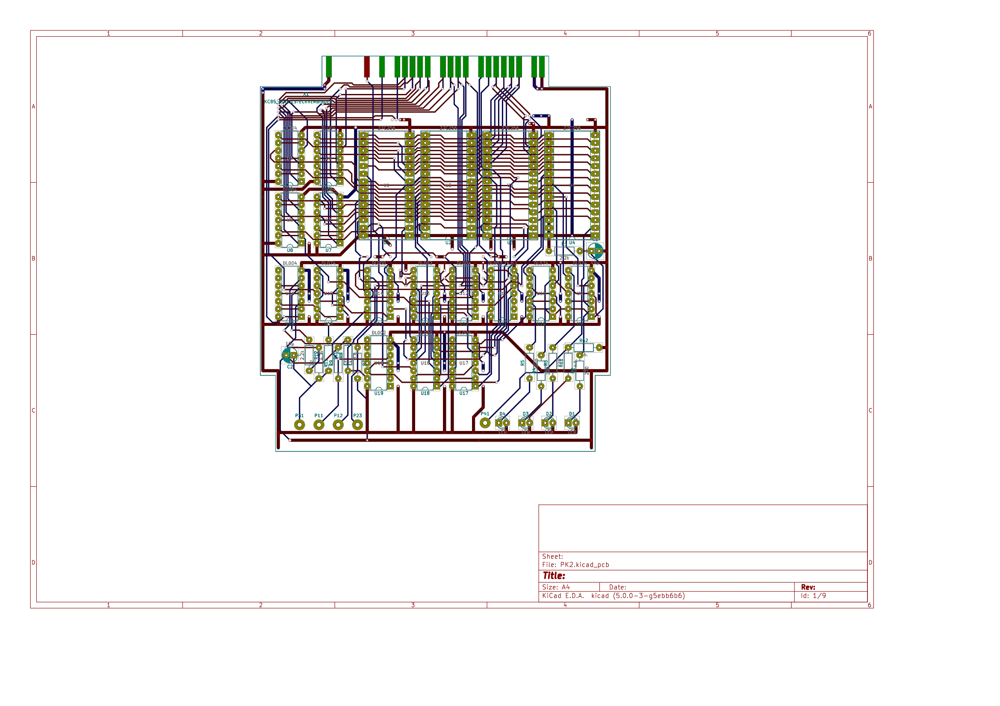

# KC85__PK2_Pruefmodul
Nachentwickelte Leiterplatte zum Prüfmodul PK2 für den KC85/4 aus Mühlhausen

## Schaltplan


## Layout


## EPROMs
Ein EPROM enthält das Betriebssystem CAOS 4.2, das andere die 16 in der Anleitung beschriebenen Prüfprogramme.
Die Prüfsumme über den Speicherinhalt wird nach CRC-CCITT (CRC-16) [^1] berechnet:
```
$ jacksum -a crc:16,1021,ffff,false,false,0 -X *.BIN
79D5    8192    Pruefmodul_CAOS_42.BIN
3578    8192    Pruefmodul_P222.BIN
```

Vielen Dank an KaiOr und Ralle für die Vorlagen!

[^1]: [Wikipedia, Zyklische Redundanzprüfung](https://de.wikipedia.org/wiki/Zyklische_Redundanzpr%C3%BCfung)
